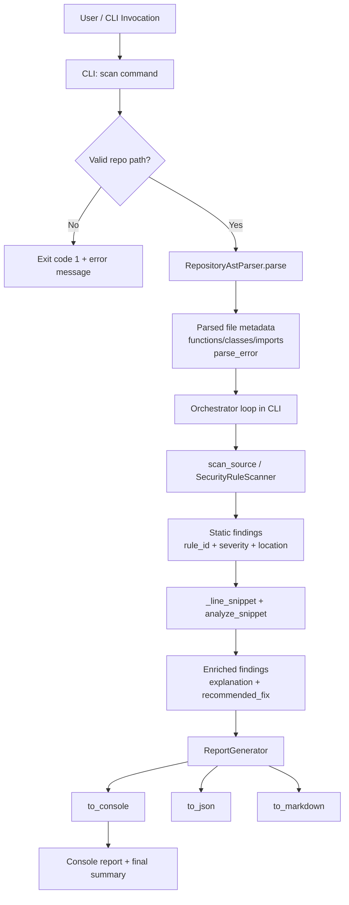

# ai-sec-audit Architecture Review

## SECTION 1 — SYSTEM OVERVIEW

### Overall goal

`ai-sec-audit` is designed as a Python CLI security scanner that combines deterministic AST-based static analysis with AI-style reasoning to produce actionable security findings for a target repository.

The implementation currently emphasizes a practical, composable pipeline:

Repository  
↓  
AST Parser  
↓  
Static Security Scanner  
↓  
LLM Reasoning  
↓  
Report Generation

### End-to-end pipeline

1. **Repository input**: user provides a repository path through CLI.
2. **AST parsing stage**: Python files are discovered and parsed to collect module-level structure (functions/classes/imports) and parse-error metadata.
3. **Static security scanning stage**: each parseable Python file is rescanned with security rules that detect unsafe patterns (`eval/exec`, unsafe deserialization, `subprocess` + `shell=True`, and likely hardcoded secrets).
4. **LLM reasoning stage**: each finding is enriched with contextual explanation and remediation guidance via a lightweight pattern-driven analyzer that mimics LLM output.
5. **Report generation stage**: enriched findings are sorted, normalized, and rendered for console output (with JSON/Markdown generation APIs available).

### Data movement between stages

- The **CLI** receives `repo_path` and orchestrates all stages.
- The **AST parser** returns a repository payload:
  - `files[]` with per-file metadata and `parse_error`
  - `summary` with file counters
- The **scanner** consumes source text per parseable file and emits structured `findings[]` + severity summary.
- The **LLM analyzer** consumes line snippets associated with each finding and returns:
  - `vulnerability_explanation`
  - `severity_level`
  - `recommended_fix`
- The **report generator** consumes enriched findings and outputs final human-readable report plus aggregate summary metrics.

---

## SECTION 2 — ARCHITECTURE BREAKDOWN

### 1) CLI Interface (`cli/main.py`)

- **Responsibility**
  - Expose commands (`version`, `scan`) and orchestrate the full scan lifecycle.
- **Inputs**
  - CLI args, especially `repo_path` for `scan`.
- **Outputs**
  - Console progress updates, findings report, final summary, process exit codes.
- **Dependencies**
  - `typer`, `Path`, parser, scanner, analyzer, report generator.
- **Key functions/classes**
  - `app` (Typer app)
  - `scan(repo_path)`
  - `_line_snippet(file_path, line_number)`

### 2) Repository Scanner (orchestration behavior inside CLI)

- **Responsibility**
  - Iterate parsed files, skip parse-error files, read source code, aggregate findings.
- **Inputs**
  - Parser output (`parsed_repo["files"]`), target root path.
- **Outputs**
  - Flattened findings list for downstream enrichment.
- **Dependencies**
  - Filesystem, `scan_source`.
- **Key functions/classes**
  - Implemented in `scan()` loop in `cli/main.py`.

### 3) AST Parser (`parser/ast_parser.py`)

- **Responsibility**
  - Discover `*.py` files and extract structural AST metadata.
- **Inputs**
  - Repository root path.
- **Outputs**
  - Dict containing repository path, per-file AST structure, and parse summaries.
- **Dependencies**
  - Python `ast`, `Path`, `json`.
- **Key functions/classes**
  - `RepositoryAstParser.parse()`
  - `RepositoryAstParser._parse_file()`
  - `_ModuleStructureExtractor` with `visit_FunctionDef`, `visit_AsyncFunctionDef`, `visit_ClassDef`, `visit_Import`, `visit_ImportFrom`

### 4) Static Security Rules Engine (`scanner/security_rules.py`)

- **Responsibility**
  - Perform AST visitor-based static detection of risky constructs.
- **Inputs**
  - Python source text and optional source path.
- **Outputs**
  - Structured result with findings, severity breakdown, parse-error metadata.
- **Dependencies**
  - Python `ast`, regex, dataclasses.
- **Key functions/classes**
  - `Finding` dataclass
  - `SecurityRuleScanner` (`visit_Call`, `visit_Assign`, `visit_AnnAssign`)
  - `scan_source`, `scan_file`, `to_json`

### 5) LLM Analyzer (`llm/analyzer.py`)

- **Responsibility**
  - Enrich suspicious snippets with security explanation, severity, and remediation text.
- **Inputs**
  - Suspicious code snippet string.
- **Outputs**
  - `AnalysisResult` (or dict via `analyze_snippet`).
- **Dependencies**
  - Dataclasses only; no external LLM call currently.
- **Key functions/classes**
  - `AnalysisResult`
  - `SnippetAnalyzer.analyze()`
  - `analyze_snippet()` helper

### 6) Report Generator (`reporting/report_generator.py`)

- **Responsibility**
  - Normalize, sort, aggregate, and render findings.
- **Inputs**
  - Iterable of finding mappings.
- **Outputs**
  - Console report (`to_console`), JSON (`to_json`), Markdown (`to_markdown`).
- **Dependencies**
  - `json`, collection typing utilities.
- **Key functions/classes**
  - `ReportGenerator`
  - `_severity_counts`, `_sorted_findings`, `_normalize_finding`

### 7) Models / Data Structures

- **Responsibility**
  - Hold domain data contracts for parser/scanner/analyzer/reporting interactions.
- **Inputs/Outputs**
  - Primarily plain dicts with a few dataclasses.
- **Dependencies**
  - Built-ins and `dataclasses`.
- **Key functions/classes**
  - `scanner.security_rules.Finding`
  - `llm.analyzer.AnalysisResult`
  - `models/` package currently acts as placeholder for future shared models.

### 8) Configuration

- **Responsibility**
  - Control runtime behavior via packaging metadata and command args.
- **Inputs**
  - CLI flags/arguments; packaging config in `pyproject.toml`; dependencies via `requirements.txt`.
- **Outputs**
  - Installed CLI behavior and dependency resolution.
- **Dependencies**
  - Python packaging toolchain.
- **Current state**
  - No dedicated runtime config object/file for rules, severity policies, excludes, or LLM providers.

### 9) Logging

- **Responsibility**
  - Emit execution progress and errors.
- **Inputs**
  - Pipeline status and validation outcomes.
- **Outputs**
  - Human-readable terminal output via `typer.echo/secho`.
- **Dependencies**
  - Typer output utilities.
- **Current state**
  - No structured logging framework or log levels yet.

### 10) Tests (`tests/`)

- **Responsibility**
  - Validate behavior of parser, scanner, analyzer, reporting, and CLI pipeline.
- **Inputs**
  - Unit-level source snippets, temp files, CLI invocations.
- **Outputs**
  - Assertions over output payloads, rule IDs, summaries, and command behavior.
- **Dependencies**
  - `pytest`, `typer.testing.CliRunner`.
- **Key coverage**
  - Parsing with/without syntax errors, static-rule detection and aliasing, analyzer defaults/pattern matches, reporting formats, and full scan orchestration.

---

## SECTION 3 — EXECUTION FLOW

### Command: `ai-sec-audit scan <repo>`

1. **CLI entry** initializes from Typer command registration.
2. **Path validation** resolves `<repo>` and verifies it exists and is a directory. Invalid paths terminate with exit code `1`.
3. **Stage [1/4] Parser** invokes `RepositoryAstParser(target).parse()`.
   - Walks recursively for Python files.
   - Parses each file into AST metadata or records syntax error.
4. **Stage [2/4] Static scanner** iterates parsed files.
   - Files with parse errors are skipped.
   - File contents are read and passed to `scan_source(...)`.
   - Findings from all files are aggregated.
5. **Stage [3/4] LLM reasoning** enriches each finding.
   - Reads the source line indicated by finding line number.
   - Passes snippet to `analyze_snippet`.
   - Merges explanation and recommended fix into finding dict.
6. **Stage [4/4] Reporting** builds `ReportGenerator(enriched_findings)` and prints console report.
7. **Summary emission** prints parsed file counts, parse-error counts, and total findings.
8. **Process completion** exits with code `0` for successful pipeline run.

---

## SECTION 4 — DATA FLOW

### Canonical transformation path

`Python files`  
→ `AST trees`  
→ `module metadata + parse diagnostics`  
→ `security findings (rule_id, severity, path, location, message)`  
→ `LLM-style explanation + recommended fix`  
→ `formatted report output (console/json/markdown)`

### Practical payload progression

1. **File discovery payload**
   - `{ repository, files[], summary }`
2. **File metadata payload**
   - `{ path, functions[], classes[], imports[], parse_error }`
3. **Finding payload (scanner)**
   - `{ rule_id, severity, message, path, line, column }`
4. **Enriched finding payload (LLM stage)**
   - Scanner payload + `{ explanation, recommended_fix }`
5. **Report payload**
   - Summary counts + sorted/normalized findings rendered into selected format.

---

## SECTION 5 — ARCHITECTURE DIAGRAM

---

## SECTION 6 — DESIGN EVALUATION

### Architecture quality

- **Strengths**
  - Clean stage-based pipeline that mirrors security scanning lifecycle.
  - Minimal but coherent implementation with low cognitive overhead.
  - Deterministic core behavior suitable for CI-friendly evolution.
- **Gaps**
  - Heavy use of untyped dict contracts across module boundaries increases schema drift risk.
  - Orchestration, progress output, and data transformation are tightly coupled in CLI.

### Modularity

- **Strengths**
  - Separate packages for parser, scanner, llm, and reporting are clear.
  - Components can be replaced independently with modest effort.
- **Gaps**
  - “Repository scanner” has no dedicated module/service abstraction.
  - `models/` is not yet used to centralize shared contracts.

### Separation of concerns

- **Strengths**
  - AST extraction logic and security-rule logic are isolated in their own modules.
  - Report formatting concerns are isolated.
- **Gaps**
  - CLI performs orchestration + transformation + policy decisions (e.g., skip parse errors).
  - LLM analyzer currently not integrated as a provider abstraction (no true model boundary).

### Testability

- **Strengths**
  - Good baseline unit tests for core components.
  - CLI tested with realistic temporary repositories.
- **Gaps**
  - No integration tests that snapshot end-to-end JSON/Markdown outputs.
  - No property/fuzz tests for parser robustness.

### Extensibility

- **Strengths**
  - Visitor-based scanner enables additional rules without changing call sites.
  - Report generator already supports multiple output formats.
- **Gaps**
  - Rule configuration is not externalized.
  - LLM strategy/provider cannot be swapped via interface/config.

### Security limitations

- No data-flow/taint tracking; detection is mostly syntactic pattern matching.
- Single-line snippet enrichment may miss surrounding context and reduce analysis quality.
- No dependency/SBOM vulnerability scanning.
- No severity normalization between static rule severity and LLM severity level.
- No baseline/suppression mechanism, risking noisy output in large repositories.

---

## SECTION 7 — IMPROVEMENTS

### 1) Code architecture

- Introduce an explicit `ScanPipeline` service with stage interfaces.
- Define shared Pydantic/dataclass models for parser output, findings, and reports.
- Move CLI to thin adapter that delegates to application service layer.

### 2) Security detection capability

- Expand rule catalog (SQL injection, path traversal, SSRF, insecure temp files, weak TLS usage).
- Add interprocedural taint analysis for source→sink tracking.
- Add framework-aware rules (Flask, Django, FastAPI).

### 3) Performance

- Parse once and reuse AST for both structure extraction and security scanning.
- Add multiprocessing for per-file scanning.
- Implement incremental scans via hash cache.

### 4) Scalability

- Add exclude globs and repository-size guardrails.
- Stream findings instead of storing all in-memory for very large repos.
- Add optional remote storage for scan artifacts.

### 5) Developer experience

- Add typed schemas and mypy checks.
- Add structured error types and richer CLI flags (`--format`, `--output`, `--fail-on-severity`).
- Improve docs with quick-start architecture and custom-rule authoring guide.

### 6) CI/CD

- Add SARIF output and GitHub code scanning upload.
- Add quality gates (exit non-zero for high/critical findings).
- Add baseline mode to fail only on new vulnerabilities.

### 7) Extensibility for additional languages

- Create language-agnostic scan interface:
  - `discover_files(language)`
  - `parse(language)`
  - `scan(language)`
- Plug in tree-sitter or language-native parsers for JavaScript/TypeScript/Go/Java.
- Keep reporting and LLM enrichment language-neutral.

---

## SECTION 8 — FUTURE CAPABILITIES

1. **Taint analysis engine**
   - Source/sanitizer/sink modeling with confidence scoring.
2. **Dependency vulnerability scanning**
   - Parse lockfiles and map to CVE feeds.
3. **GitHub integration**
   - PR comments, annotations, and code-scanning ingestion.
4. **CI scanning modes**
   - Fast diff-only scan vs full scheduled deep scan.
5. **Multi-language support**
   - Common finding schema across Python/JS/Go/Java.
6. **Prompt injection detection**
   - Rules for insecure prompt construction, unsanitized tool calls, unsafe retrieval/plugin behavior.
7. **Policy-as-code**
   - Organization-specific severity overrides and allow/deny policies.
8. **Triage workflow tooling**
   - Finding status lifecycle (open/accepted risk/fixed), suppressions with expiration, and auditor notes.

---

## Closing note

The current repository is a strong foundational scaffold: simple architecture, understandable flow, and test-backed modules. The next step is to harden contracts, decouple orchestration from CLI, and evolve from pattern matching toward semantic security analysis at scale.
